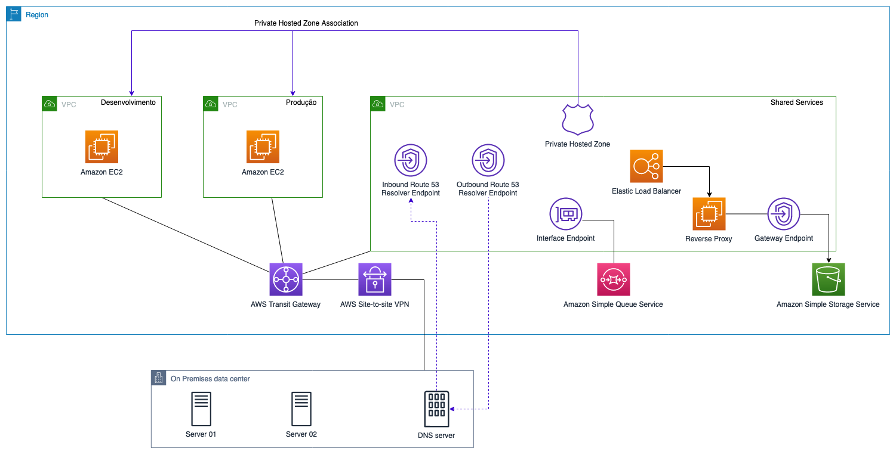

# AWS DNS Infrastructure on Hybrid Environment

This repository contains a simple AWS architecture that automates the construction of a DNS infrastructure on a Hybrid Environment. The solution leverages Amazon Route 53 (Route 53 Resolver and Hosted zones), VPC Endpoints and AWS Transit Gateway.

 

 

## CloudFormation
This repository includes a CloudFormation Stack for deployment automation.

## Getting Started
### Setup
* An Amazon EC2 KeyPair is required to launch the CloudFormation stack.
* If necessary, an OnPremises Environment can be simulated with the following link: TBD

_Note: Tested on the following regions: us-east-1 (N. Virginia), us-east-2 (Ohio) and eu-west-1 (Ireland)

## License Summary
This repository is made available under the MIT-0 license. See the LICENSE file.
