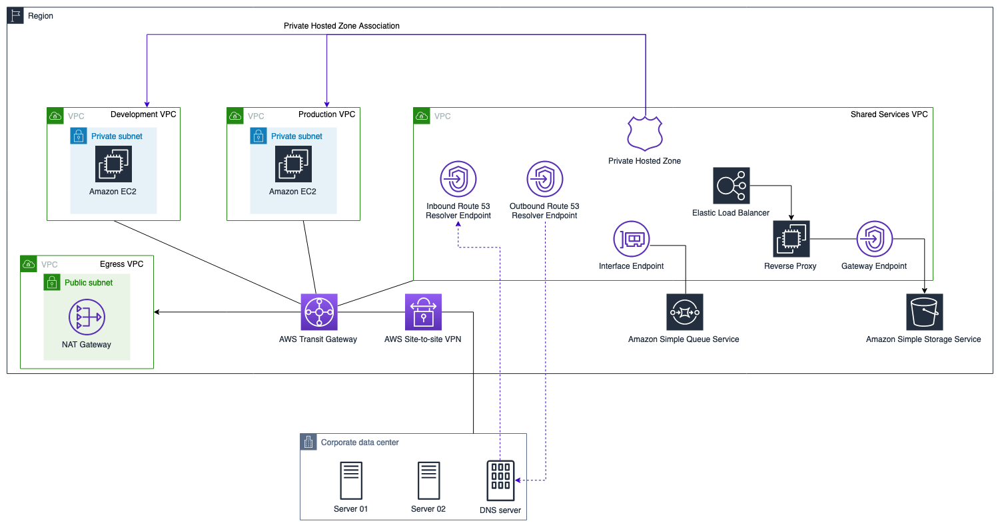

# AWS DNS Infrastructure on Hybrid Environment

This repository contains a simple AWS architecture that automates the construction of a DNS infrastructure on a Hybrid Environment. The solution leverages Amazon Route 53 (Route 53 Resolver and Hosted zones), VPC Endpoints and AWS Transit Gateway.

 

 

# CloudFormation
This repository includes a CloudFormation Stack for deployment automation.